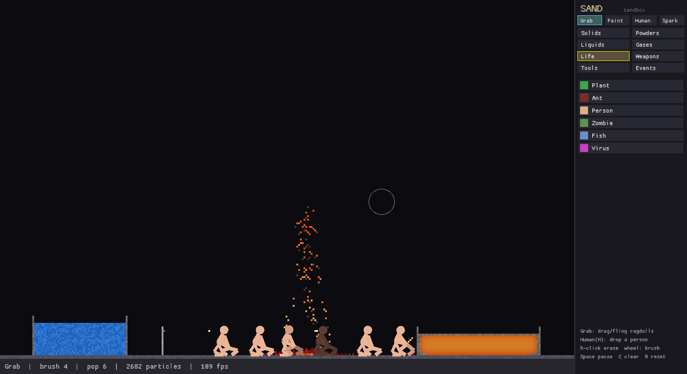

# Sand — an advanced native falling-sand sandbox

A desktop falling-sand toy in the spirit of the classic web "powder games", but
built as a native application in **Rust** with a focus on *emergent* physics
rather than a long list of hard-coded special cases.



The screenshot above is a single simulated scene: oil floating on a water basin
(left), a faucet pouring a water stream (centre), a wooden block mid-combustion
throwing a plume of fire and smoke (right), and a lava pool cooling into a stone
crust on a shelf (far right).

## Ragdoll people — a physics layer on the sand

On top of the cellular grid runs a **Verlet ragdoll** system: articulated humans
made of point masses and distance constraints that collide with the terrain and
react to everything the sandbox can throw at them. This is the headline feature.

- **Grab & fling** (default tool): click-drag any limb to pick a body up and
  throw it — Verlet history makes the throws feel weighty.
- **They stand when alive, go limp when dead.** A gentle balance keeps a living
  person upright; shove them and they stagger and recover, until they don't.
- **Full dismemberment.** Every region (head, torso, arms, legs) has its own
  health. Bullets punch through flesh, explosions send bodies flying and tear
  off limbs, fire ignites and chars them black, lava and acid kill, electricity
  makes them spasm, and water makes them float. Limbs **sever** at zero health
  and everything **bleeds** real blood onto the grid.

Drop people with the **Human** tool (`H`), then experiment.

## What makes it "more advanced"

Most web sand games script every interaction as an explicit `A + B -> C` rule.
Sand instead runs a couple of small physical *fields* and lets the interesting
behaviour fall out of them:

- **A real temperature field with heat diffusion.** Every cell has a
  temperature; heat spreads each frame. Materials change *phase* by temperature,
  so you get behaviour for free: lava radiates heat, ignites nearby wood/oil and
  slowly **cools into stone from the edges inward** (a crust); water touching
  lava **boils to steam** which **condenses back to water** as it cools; ice
  melts near flame; wood and plants combust when they get hot enough.
- **Density-based movement.** Powders, liquids and gases all displace each other
  by density, so **oil floats on water**, **sand sinks through both**, smoke and
  steam rise, and lava sinks below water.
- **Electrical conduction.** Charge propagates one cell per frame through metal
  and water (the *Spark* tool), detonating gunpowder/bombs and igniting oil —
  build wires and circuits.
- **Life & chemistry.** Ants wander, eat and multiply; people walk, climb,
  flee fire, drown and bleed; zombies hunt people and turn them; fish swim and
  suffocate out of water; a virus infects organic matter; seeds sprout into
  climbing plants; acid dissolves solids; salt makes brine.
- **God-mode disasters & weather.** Don't just paint — *direct chaos*. Call down
  meteor showers, lightning that powers your circuits, erupting volcanoes,
  building-collapsing earthquakes (with screen shake), floods and plagues, then
  toggle rain, acid rain, and **wind that fans wildfires and blows smoke**. The
  people panic and flee; every run plays out differently.

## Elements

Picked from seven **submenu tabs** in the side panel:

- **Solids** — Wall · Stone · Brick · Wood · Metal · Glass · Ice
- **Powders** — Sand · Dirt · Salt · Coal · Gunpowder · Snow · Ash · Seed ·
  Concrete (cures into stone)
- **Liquids** — Water · Oil · Gasoline · Acid · Lava · Blood · Mercury
  (heavy & conductive) · Napalm (sticky fire)
- **Gases** — Steam · Smoke · Toxic Gas · Methane (explosive) · Fire
- **Life** — Plant · Ant · **Person** · **Zombie** · **Fish** · Virus
- **Weapons** — Bomb · TNT · C4 (remote-detonated by spark) · Nuke · Mine
  (pressure-triggered) · Grenade (timed) · Fireworks · Missile · Turret Gun
  (fires bullets) · Laser (cutting beam)
- **Tools** — Eraser · Faucet · Cloner (copies any material) · Void (deletes) ·
  Heater · Cooler · Spark
- **Events** (disasters & weather, not painted) — Meteor Shower · Lightning ·
  Volcano · Earthquake · Flood · Plague · Rain · Acid Rain · Wind ←/→ · Calm

Plus emergent materials you don't paint directly (Saltwater, Ember, Bullet,
Meteor, Volcano).

## Build & run

Requires a Rust toolchain (`rustup`) and a desktop OpenGL context.

```sh
cargo run --release
```

### Controls

| Input | Action |
|-------|--------|
| Left click | Use the active tool (Grab / Paint / Human / Spark) |
| Right click / drag | Erase |
| `G` `B` `H` `Z` | Grab · Paint · Human (drop a person) · Spark tools |
| Grab-drag | Pick up and fling ragdolls |
| Mouse wheel | Brush size (0 = single cell, for placing one turret etc.) |
| Click a tab / swatch | Switch submenu / select material (→ Paint) |
| `1`–`9` | Quick-pick within the active submenu |
| `Space` | Pause / resume |
| `C` | Clear the world |
| `R` | Reset everything |
| `M` `L` `V` `E` `F` `P` | Meteor · Lightning (at cursor) · Volcano · Earthquake · Flood · Plague |
| `O` `I` `,` `.` `/` | Rain · Acid rain · Wind ← · Wind → · Calm/clear weather |

### Headless showcase

The binary can seed a demo scene, simulate it, and export a PNG without any
interaction — useful for CI or generating the image above:

```sh
SAND_DEMO=1 SAND_SCREENSHOT=showcase.png SAND_SHOT_FRAME=45 cargo run --release
```

## Architecture

```
src/
  element.rs   element catalogue + static properties (colour, density, ...)
  world.rs     the simulation: cell grid, temperature field, movement,
               chemistry, electricity, heat diffusion, phase changes
  physics.rs   the Verlet ragdoll layer: articulated humans, collision,
               grab/throw, dismemberment, and reactions to the grid
  ui.rs        side-panel palette + tool/tab bar + status bar
  main.rs      window, input, and the GPU-texture render path
```

Each `World::step()` runs four passes: clear move-flags → propagate charge →
movement + chemistry (scanned bottom-up, alternating x direction to avoid drift
bias) → heat (emit from sources, diffuse, apply phase changes). The whole grid
is uploaded to a single GPU texture each frame, so rendering ~120k cells is
effectively free and the CPU budget goes to physics. After the grid steps, the
ragdoll layer integrates on top of it — reading terrain, temperature, charge and
bullets out of the grid, and writing blood, fire and smoke back into it.

Run the physics tests (no display needed) with:

```sh
cargo test
```
